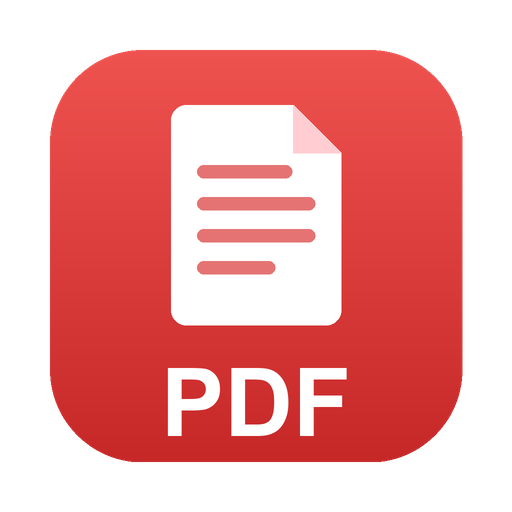

<div align="center">
  
  <h1>TelosPDF</h1>
  <p>
    <a href="https://github.com/Open-Productivity-Apps/TelosPDF/releases/latest"></a>
    <a href="https://open-productivity-apps.github.io/TelosPDF/"></a>
    <a href="LICENSE"></a>
    
  </p>
  <p><b>An open-source PDF workstation</b> — a free alternative to paid PDF software, in a
  fast modern workbench. Fully offline, MIT-licensed, built with Rust + PDFium + Tauri 2.</p>
</div>

## Features

- **View & navigate** — continuous scroll, tabs, thumbnails, bookmarks, search with
  highlights; pages render in the Rust core, never in the webview.
- **Edit** — click any text or object on the page to edit or delete it; add new text.
- **Organize pages** — reorder, rotate, delete, extract, insert blank pages.
- **Fill & Sign** — form filling, drawn signatures, stamps; placements stay movable and
  undoable (⌘Z) until you Save, and are tracked in a side panel.
- **Markup** — freehand ink, shapes, arrows, and text boxes baked into the PDF.
- **Comments** — colour-coded sticky notes, tracked in a panel.
- **Redact** — content is permanently removed, not drawn over.
- **Scan & OCR** — bundled Tesseract, or Baidu's Unlimited-OCR 3B model (one-click
  download in Settings → OCR) for state-of-the-art accuracy on scans, tables, and CJK.
- **Compare, convert, protect, compress, print** — text-level diffs, Office ↔ PDF via
  LibreOffice, AES-256 passwords, structural compression, and a real print dialog.
- **Personal** — Light/Dark/System themes with a pure-black OLED mode, and a Region &
  language section with 95 downloadable community translations.

## Download

Grab the latest from [Releases](https://github.com/Open-Productivity-Apps/TelosPDF/releases):
macOS (`.dmg`, Apple Silicon & Intel), Windows (`.msi`), Linux (`.deb`/`.rpm`/AppImage).

## System requirements

| Platform | Minimum |
|---|---|
| macOS (Apple Silicon) | macOS 11 Big Sur or later |
| macOS (Intel) | macOS 11 Big Sur or later, 64-bit |
| Windows | Windows 10 (1803) or later, 64-bit, WebView2 (installed automatically) |
| Linux | 64-bit distro with WebKitGTK 4.1 (Ubuntu 22.04+, Fedora 36+, or equivalent) |

4 GB RAM and ~150 MB disk for the app itself. The optional AI features download
extra models (Unlimited-OCR ~2.5 GB, local translation ~1.8 GB) and want 8 GB+
RAM — Apple Silicon or a recent CPU recommended; Google Cloud translation needs
only a network connection and your API key.

## Building

Prereqs: Rust (stable), Node 22+, pnpm 9+, and the
[Tauri v2 system deps](https://v2.tauri.app/start/prerequisites/) for your OS.

```sh
cargo xtask fetch-pdfium   # downloads the pinned PDFium prebuilt into .pdfium/
pnpm install
pnpm tauri dev             # run the app
pnpm tauri build           # produce installers for your platform
```

MIT license. Dependency licensing is gated in CI (`deny.toml`) — only permissive
licences ever ship. Contributions welcome: see [CONTRIBUTING.md](CONTRIBUTING.md).
